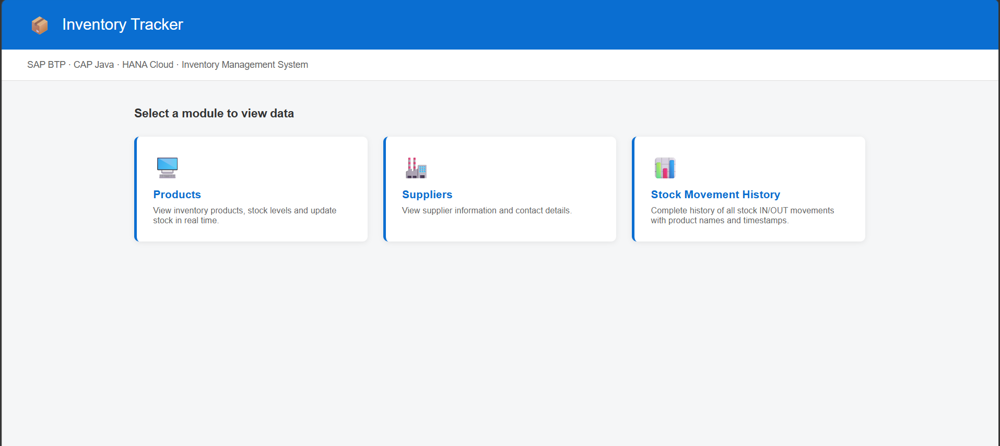
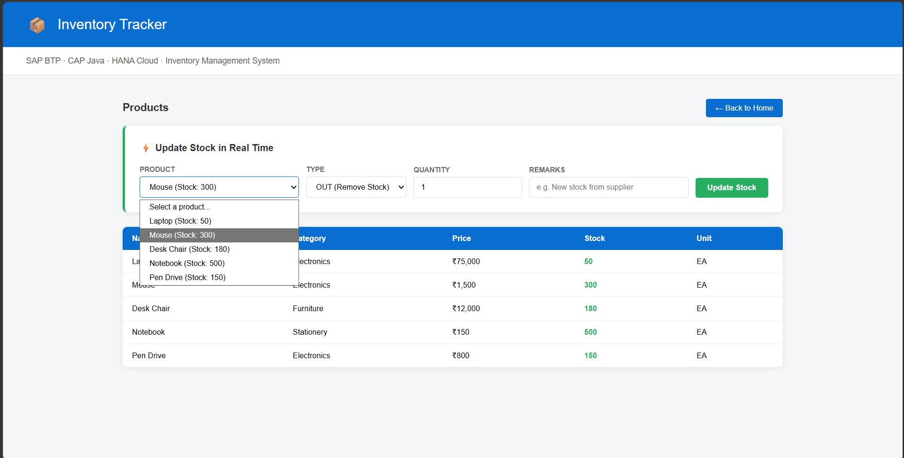
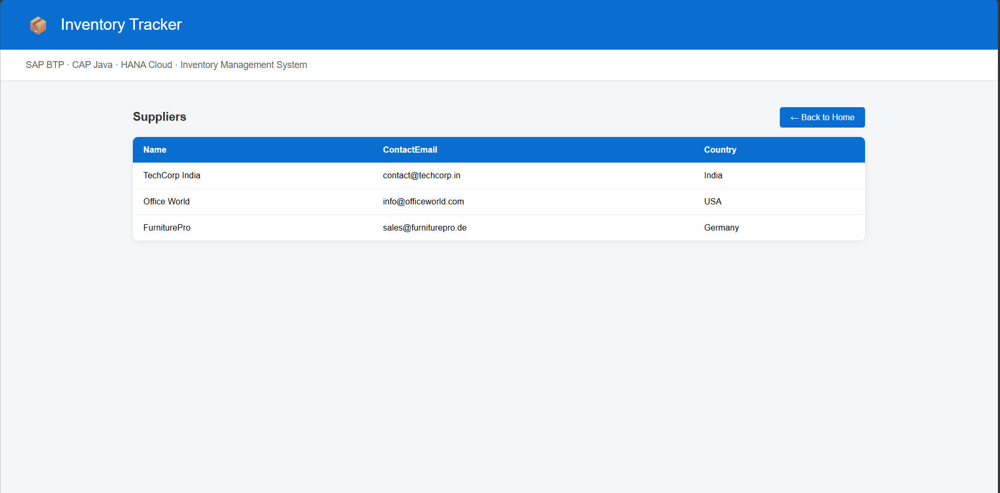
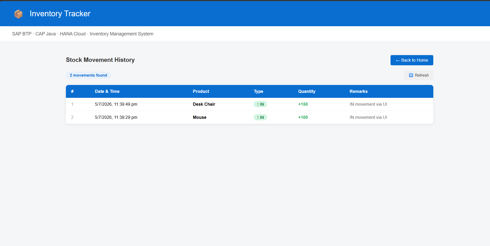

Inventory Management System built with SAP CAP Java, HANA Cloud, and XSUAA deployed on SAP BTP Cloud Foundry.

## 🌐 Live Demo
https://b9a4c56btrial-dev-inventory-tracker.cfapps.us10-001.hana.ondemand.com

## 🛠️ Tech Stack

| Technology | Purpose |
|---|---|
| SAP CAP Java | Cloud Application Programming Model backend |
| SAP HANA Cloud | Cloud database (Free Tier) |
| SAP XSUAA | Authentication & Authorization |
| SAP Cloud Foundry | Deployment platform |
| SAP Approuter | Browser-based login & request routing |
| OData V4 | REST API standard |
| Spring Boot | Java application framework |
| MTA (Multi-Target App) | Deployment packaging |

## ✨ Features

- 📦 **Products Management** — View all inventory products with stock levels, prices, and categories
- 🏭 **Suppliers Management** — View supplier information and contact details
- ⚡ **Real-time Stock Updates** — Update stock IN/OUT directly from the browser UI
- 📊 **Stock Movement History** — Complete history of all stock movements with product names and timestamps
- 🔐 **Role-based Security** — XSUAA authentication with InventoryAdmin role
- ✅ **Custom Java Handlers** — Validates stock levels, prevents negative stock, auto-updates on movements
- 🎨 **Browser UI** — Clean SAP-styled HTML/JS frontend served via Approuter

## 📸 Screenshots

### Home Page

*Main navigation page with three module cards — Products, Suppliers, Stock Movements*

### Products Page with Real-time Stock Update

*Products list with stock levels highlighted in green/red, and the real-time stock update form*

### Suppliers Page

*Supplier information including contact email and country*

### Stock Movement History

*Complete chronological history of all IN/OUT stock movements with product names, quantities and timestamps*

## 📁 Project Structure
inventory-tracker/
│
├── app/                          # Frontend / Approuter
│   └── router/
│       ├── index.html            # Main UI (home page + data tables + stock update form)
│       ├── xs-app.json           # Approuter routing configuration
│       ├── package.json          # Approuter dependencies (@sap/approuter)
│       └── default-env.json      # Local environment config (not committed)
│
├── db/                           # Database layer
│   ├── schema.cds                # CDS data model (Products, Suppliers, StockMovements)
│   └── data/                     # Sample seed data (CSV files)
│       ├── customer.inventory-Products.csv
│       └── customer.inventory-Suppliers.csv
│
├── srv/                          # Service layer (CAP Java backend)
│   ├── inventory-service.cds     # OData service definition (InventoryService, StockService)
│   ├── pom.xml                   # Maven dependencies
│   └── src/
│       └── main/
│           ├── java/
│           │   └── customer/
│           │       └── inventorytracker/
│           │           ├── Application.java          # Spring Boot entry point
│           │           └── handlers/
│           │               └── InventoryHandler.java # Custom event handler
│           └── resources/
│               └── application.yaml                  # Spring Boot config + mock users
│
├── mta.yaml                      # MTA deployment descriptor
├── xs-security.json              # XSUAA security config (roles, scopes)
├── package.json                  # Root npm config (CDS dependencies)
├── pom.xml                       # Root Maven POM
└── .gitignore                    # Git ignore rules

## 🏗️ Architecture
Browser
│
▼
Approuter (inventory-tracker)          ← Handles login, CSRF, routing
│
├──/odata/v4/──────────────────────►  CAP Java Service (inventory-tracker-srv)
│                                         │
│                                         ├── InventoryService  (requires InventoryAdmin)
│                                         │     ├── Products
│                                         │     ├── Suppliers
│                                         │     └── StockMovements
│                                         │
│                                         └── Custom Java Handler
│                                               ├── Validate stock on OUT movement
│                                               └── Auto-update product stock
│
└── XSUAA (inventory-tracker-auth)  ← OAuth2 / JWT token validation
│
└── HANA Cloud (inventory-tracker-db)  ← SAP HANA HDI Container

## 🔐 Security

- All endpoints secured with **SAP XSUAA** (OAuth2/JWT)
- `InventoryService` requires **InventoryAdmin** role
- Role collection **"InventoryAdmin (inventory-tracker b9a4c56btrial-dev)"** auto-created on deployment
- Assign this role collection to users via BTP Cockpit → Security → Role Collections

## 📊 Data Model
Products
├── ID (UUID, key)
├── name (String)
├── description (String)
├── category (String)
├── price (Decimal)
├── stock (Integer)
├── unit (String)
└── supplier (Association to Suppliers)
Suppliers
├── ID (UUID, key)
├── name (String)
├── contactEmail (String)
├── country (String)
└── products (Association to many Products)
StockMovements
├── ID (UUID, key)
├── product (Association to Products)
├── type (String: IN/OUT)
├── quantity (Integer)
└── remarks (String)

## ⚙️ Custom Java Handler (InventoryHandler.java)

The handler intercepts every `StockMovements` CREATE event and:
1. Fetches the current product from the database
2. For **OUT** movements — validates there is enough stock, throws `400 Bad Request` if not
3. For **IN** movements — adds the quantity to current stock
4. Updates the product stock level in the database

## 🚀 Local Setup

### Prerequisites
- Java 21+
- Maven 3.8+
- Node.js 18+
- SAP CDS DK (`npm install -g @sap/cds-dk@^9`)

### Run locally
```bash
# Clone the repo
git clone https://github.com/17Anurag/Inventory-Management-System.git
cd Inventory-Management-System

# Install dependencies
npm install

# Run the application
mvn spring-boot:run

# Open in browser
http://localhost:8080
```

### Local test users (mock auth)
| Username | Password | Role |
|---|---|---|
| admin | admin123 | InventoryAdmin |
| viewer | viewer123 | InventoryViewer |

## ☁️ Deploy to SAP BTP

### Prerequisites
- SAP BTP Trial account
- SAP HANA Cloud instance (hana-free plan)
- Cloud Foundry CLI installed
- MTA Build Tool (`npm install -g mbt`)

### Deploy steps
```bash
# Login to Cloud Foundry
cf login -a https://api.cf.us10-001.hana.ondemand.com

# Build MTA archive
mbt build -t gen --mtar mta.mtar

# Deploy to BTP
cf deploy gen/mta.mtar --delete-services

# Check status
cf apps
```

### BTP Services created on deployment
| Service | Type | Purpose |
|---|---|---|
| inventory-tracker-auth | XSUAA application | Authentication |
| inventory-tracker-db | HANA hdi-shared | Database schema |

## 📝 API Endpoints

Base URL: `https://b9a4c56btrial-dev-inventory-tracker-srv.cfapps.us10-001.hana.ondemand.com`

| Method | Endpoint | Description |
|---|---|---|
| GET | /odata/v4/InventoryService/Products | List all products |
| GET | /odata/v4/InventoryService/Suppliers | List all suppliers |
| GET | /odata/v4/InventoryService/StockMovements | List all movements |
| POST | /odata/v4/InventoryService/StockMovements | Create stock movement |

## 👨‍💻 Author
**Anurag** — [@17Anurag](https://github.com/17Anurag)

Built as a learning project for SAP BTP / CAP Java development.
EOF

git add README.md
git commit -m "Update README with screenshots"
git push
